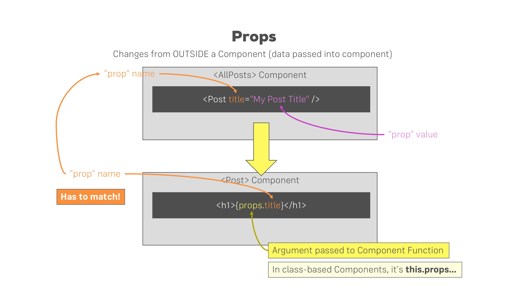
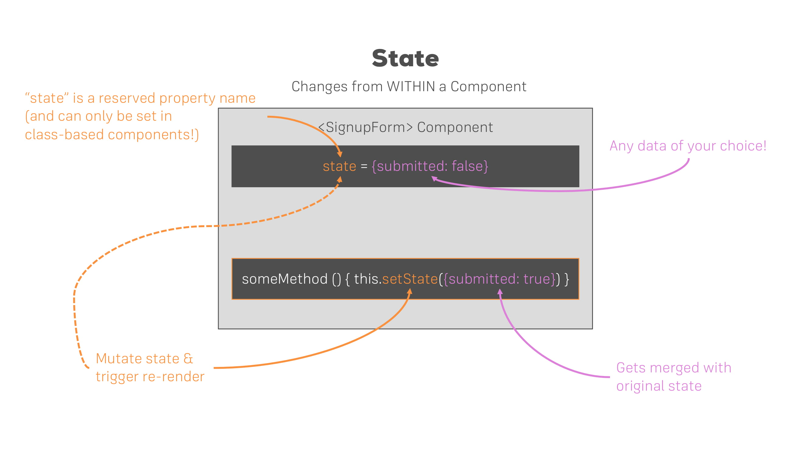
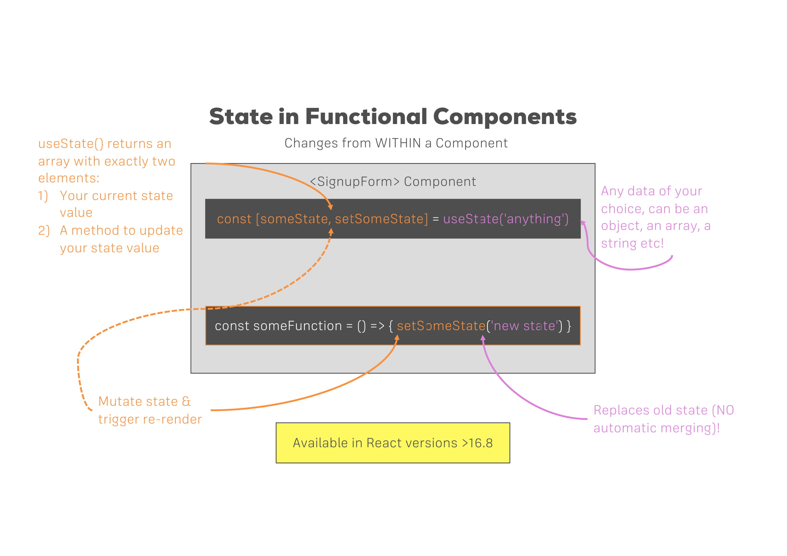

# Notes

## Section 1: Getting Started

| Single Page Applications | Multi Page Applications |
| ------------------------ | ----------------------- |
| One HTML page, content is (re)rendered on client | Multiple HTML pages, content is rendered on server |
| All React components controlled by an overarching root React component | Standard HTML, CSS, JS with isolated React "widgets" scattered |
| Typically one ReactDOM.render() call | One ReactDOM.render() call per widget |

## Section 2: Refreshing Next Generation JavaScript

- Use `let` over `var`
- Arrow functions:

  ```javascript
    const myFunc = () => {
      ...
    }

    // If only one argument
    const myFunc = arg => {
      console.log(arg);
    }

    // Function one-liners
    const myFunc = (num) => num * 2;
  ```

- Exports and imports
  - `export default` just means the export can be named anything when imported
  - Named exports (just `export`) can still be assigned another name:

    ```javascript
      import { smth as Smth } from 'file.js'
    ```

  - Import all becomes properties

    ```javascript
      import * as bundled from 'file.js'

      console.log(bundled.item);
    ```

- Classes
  - ES6:

    ```javascript
      class Human {
        constructor() {
          this.gender = 'Male'; // Property
        }
        call () { // Method
          console.log(this.gender); 
        }
      }

      class Person extends Human {
        constructor() { // Default method for initiating properties
          super(); // Required for inheritance
          this.name = 'Max';
        }
      }

      const myPerson = new Person();
      myPerson.call();
    ```

  - ES7:

    ```javascript
      class Human {
        gender = 'Male';
        call = () => console.log(this.gender);
      }

      class Person extends Human {
        name = 'Max';
      }
    ```

- Spread and rest operators
  - Spread - used to split up array elements OR object properties:

    ```javascript
      const numbers = [1, 2, 3];
      const newNumbers = [...numbers, 4]; // [1, 2, 3, 4]

      const person = {
        name: 'Max'
      }

      const newPerson = {
        ...person, // name: "Max"
        age: 28
      }
    ```

  - Rest - used to merge a list of function arguments into an array:

    ```javascript
      const filter = (...args) => {
        return args.filter(el => el === 1);
        // Merges all arguments into one array then keeps only values of 1
      }

      filter(1 , 2, 3); // [1]
    ```

- Destructuring
  - Easily extract array elements or object properties and store them in variables
  - Array destructuring:

    ```javascript
      [a, , c] = ['Hello', 'there', 'Max']; // Leave one out
    ```

  - Object destructuring:

    ```javascript
      { name } = { name: 'Max', age: 28 };
      console.log(age) // undefined
    ```

- Primitive types are real-copies; objects and array are reference types
  - To produce a real copy:

    ```javascript
      const secondPerson = {
        ...person
      }
    ```

- Array functions (execute function on each element):

  ```javascript
    const numbers = [1, 2, 3];
    const doubleNumArray = numbers.map((num) => {
      return num * 2;
    });
    // Note: .map() creates a real copy
  ```

## Section 3: Understanding the Base Features & Syntax

- Component tree - one root component and unlimited nested child components
- JSX is syntax for writing HTML-ish code in JS
- `className` is used because `class` is already used in JS
- Typically one root element per `return`
- Props and states
  - Only changes in `props` and/or `state` trigger re-rendering
  - `props` - allows passing of data from parent component to child
  - Access `item` property via `props.item`
  
  - `state` - used to change component state from within (only available to extended classes)
  
  - Access state `someState` using `this.state.someState`
- [React supported events](https://reactjs.org/docs/events.html#supported-events)
- Use `this.setState` to mutate `state` variables
- Functional component
  - `useState` returns two arguments:
    1. The current state
    2. A function that allows us to update the state such that React is aware of it
  - Call `useState` multiple times for each state to avoid overwriting/merging issues
  
  - No longer use `this` (not in a class)
- Class vs functional component:
  - Class components **merges** the state
  - Functional components **overwrites** the state
- Good practice to use stateless (dumb/presentational) over stateful components when possible

## Section 4: Working with Lists and Conditionals

- 