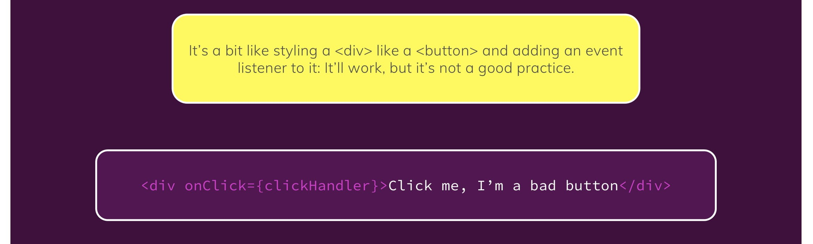
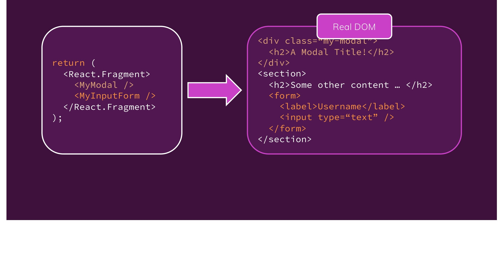

# Notes

## Section 1: Getting Started

| Single Page Applications                                               | Multi Page Applications                                        |
| ---------------------------------------------------------------------- | -------------------------------------------------------------- |
| One HTML page, content is (re)rendered on client                       | Multiple HTML pages, content is rendered on server             |
| All React components controlled by an overarching root React component | Standard HTML, CSS, JS with isolated React "widgets" scattered |
| Typically one ReactDOM.render() call                                   | One ReactDOM.render() call per widget                          |
| Fetch once initially and never reload                                  | Reload and fetch for every HTML page                           |

## Section 2: JavaScript Refresher

- Use `let` and `const` over `var`
- Arrow functions:

  ```javascript
    const myFunc = () => {
      ...
    }

    // If only one argument
    const myFunc = arg => {
      console.log(arg);
    }

    // Function one-liners
    const myFunc = (num) => num * 2;
  ```

- Exports and imports

  - `export default` just means the export can be named anything when imported
  - Named exports (just `export`) can still be assigned another name:

    ```javascript
    import { smth as Smth } from "file.js";
    ```

  - Import all becomes properties

    ```javascript
    import * as bundled from "file.js";

    console.log(bundled.item);
    ```

- Classes

  - ES6:

    ```javascript
    class Human {
      constructor() {
        this.gender = "Male"; // Property
      }
      call() {
        // Method
        console.log(this.gender);
      }
    }

    class Person extends Human {
      constructor() {
        // Default method for initiating properties
        super(); // Required for inheritance
        this.name = "Max";
      }
    }

    const myPerson = new Person();
    myPerson.call();
    ```

  - ES7:

    ```javascript
    class Human {
      gender = "Male";
      call = () => console.log(this.gender);
    }

    class Person extends Human {
      name = "Max";
    }
    ```

- Spread and rest operators

  - Spread - used to split up array elements OR object properties:

    ```javascript
    const numbers = [1, 2, 3];
    const newNumbers = [...numbers, 4]; // [1, 2, 3, 4]

    const person = {
      name: "Max",
    };

    const newPerson = {
      ...person, // name: "Max"
      age: 28,
    };
    ```

  - Rest - used to merge a list of function arguments into an array:

    ```javascript
    const filter = (...args) => {
      return args.filter((el) => el === 1);
      // Merges all arguments into one array then keeps only values of 1
    };

    filter(1, 2, 3); // [1]
    ```

- Destructuring

  - Easily extract array elements or object properties and store them in variables
  - Array destructuring:

    ```javascript
    [a, , c] = ["Hello", "there", "Max"]; // Leave one out
    ```

  - Object destructuring:

    ```javascript
      { name } = { name: 'Max', age: 28 };
      console.log(age) // undefined
    ```

- Primitive types are real-copies; objects and array are reference types

  - To produce a real copy:

    ```javascript
    const secondPerson = {
      ...person,
    };
    ```

- Array functions (execute function on each element):

  ```javascript
  const numbers = [1, 2, 3];
  const doubleNumArray = numbers.map((num) => {
    return num * 2;
  });
  // Note: .map() creates a real copy
  ```

## Section 3: React Basics & Working with Components

- `index.js` is first to be executed
- One file per component
- A component in React is just a JavaScript function that returns HTML code
  
- **Declarative** approach - define the desired target state(s) and let React figure out the actual JavaScript DOM instructions
  
- Use `className` in JSX
  
- Avoid too much syntax in curly braces (string literal) - instead, do the processing first (outside the `return`)
- Can use self-enclosing tag if no content between
- `props.children` is reserved for the content between tags

## Section 4: React State & Working with Events

- Good practice to name event handler function ending with 'Handler'
- React hooks can only be called in React component (functions)
- `useState()` returns an array with exactly two indices
  - 'Special variable'
  - Function to update this 'special variable'
- State is separated on a per-component basis

  - I.e. the update function is only called once, and on the element it was called from
  - The entire component is rerun
    

- `useState()` is called once upon initialisation of the component, but is not rerun after (even when the component is updated)
- Combining multiple states into a single object means all states have to be updated
  - Best practice to pass an anonymous function to ensure it is always receiving the latest state snapshot
  - Especially if the new state update depends on the previous
- If `a(func)` takes a pointer to a function as input, then running `a(input1)` will call `func(input1)`
  

- **Controlled component** - both the value and changes to the value are handled by the parent component
- Stateless/presentational/dumb - no internal state
  


## Section 5: Rendering Lists & Conditional Content

- Spread operator (`...`) works on both arrays and objects
- React updates all elements that look similar
  - This can mess up states
  - And cause performance issues
  - Solution: add a `key` property to components
- In general, it's a good idea to attach a `key` property whenever elements are rendered in a loop
- `&&` can be used as a ternary operator - second part is outputted if the first part is true
- Dynamic style must be in objects, i.e. `style={{ ... }}`
- `for ... in ...` - objects
- `for ... of ...` - arrays
- Conditional elements are useful to show and hide elements (avoids assigning hide classes)
  - To do this, use `{ a && b }` which will output `b` if `a` is true
  - Or `{ c || d }` which will output `d` if `c` is false

## Section 6: Styling React Components

- CSS modules:

  - CSS files need the `.module.css` file extension
  - In the JS file

  ```js
  import styles from "./Component.module.css";
  ```

  - Add classes using `className={styles.name}`
  - For kebab-case use `className={styles["my-class"]}`

- Use template literals to dynamically set classes, e.g.

```js
  <div className={`form-control ${!isValid ? 'invalid' : ''}`}>

  <div className={`${styles["form-control"]} ${!isValid && styles.invalid}`}>
```

## Section 7: Debugging React Apps

## Section 8: Time to Practice: A Complete Practice Project

- Good idea to store errors in a JS object to use `error.title` and `error.message` etc.
- Best practice to use the intended tag for the intended purpose (e.g. a `<button>` for buttons - not `<div>`)

## Section 9: Diving Deeper: Working with Fragments, Portals & Ref's

### Fragments


- JSX only able to return one root node - results in the `<div>` soup problem of too many nested divs

  

  - Solution: use `Fragment`s
    

### Portals

- Portals are a way of rendering certain elements/components elsewhere (usually within another element)
- Most useful for overlays, backdrops, sidedrawers






### Ref's

- Refs are similar to states but almost always intended for read-only purposes

- In general, **don't use `ref`s to manipulate the DOM**
- Exception: resetting user input (edge-case)
  - OK because not really manipulating the DOM (e.g. not adding new elements or changing the CSS class)
  - But rarely do this
- Use if just wanting to quickly read a value but never changing it
- Advantage: less code than states
- Disadvantage: can't manipulate the DOM

#### Controlled vs uncontrolled

- When the state of a component is not controlled with React, it is **uncontrolled**

  - typically using refs means it's uncontrolled (assuming no manipulation is done using the ref)

- **Controlled** component - form data is handled by a React component

  - Takes its current value through `props` and notifies changes through callbackes (e.g. `onChange`)
  - A parent component "controls" it by handling the callback and managing its own state and passing the new values as props to the controlled component (aka a "dumb" component)

- **Uncontrolled** components - form data is handled by the DOM itself

  - Instead of writing an event handler for every state update, use a ref to get form values from the DOM
  - Stores its own state internally
  - Query the DOM using a ref to find its current value when needed

## Section 10: Side Effects, Reducers & the Context API

### Side Effects


- `useEffect()` hook runs **AFTER** a component is updated
- Commonly used to rerun logic when certain data (props, states) or anything is changed; i.e. whenever you have an action that should be executed in response to some other action
- Should add "everything" used in the effect function as a dependency, with exceptions:
  - Don't need to add state updating functions
  - Don't need to add "built-in" APIs or function (e.g. `fetch()`, `localStorage` )
  - Don't need to add variable or functions defined outside of the component
- In general, dependencies are things that could change because the component (or parent component) is re-rendered
- See [here for an example](https://www.udemy.com/course/react-the-complete-guide-incl-redux/learn/lecture/25871518#notes)
- **Cleanup function** does not run on the first side effect execution, but will run BEFORE everytime thereafter
  - Implemented as a function that is returned
  - Useful when combined with debouncing

### Reducers

- `useState()` may become hard or error-prone to use with more complex states (multiple states, multiple ways of changing it, dependencies on other states)
  

- `useReducer()` can be used as a replacement if require "more powerful state management"
- Use when updating a state that depends on another state
- Use when updating multiple states simultaneously


- "Custom extension" of `useState()`
- Good practice to optimise `useEffect()` so that it is only run when needed

  - E.g. use object destructuring to pull a property out of a state and use the extracted property as the dependency, **NOT** the entire state (with its multiple properties)
  - [Read more here](https://www.udemy.com/course/react-the-complete-guide-incl-redux/learn/lecture/26043040#notes)


### Context API

- Method of storing data and accessing across components rather than passing through states and props
  
  
- Look [here](./effects-reducers-context/src/App.js), [here](./effects-reducers-context/src/components/MainHeader/Navigation.js), and [here](./effects-reducers-context/src/store/auth-context.js) to find examples on how to use the context API
- When to use:
  - Passing variables/functions/objects through multiple components
  - Forwarding to an element that does something specific (and always will)
  - But in most cases, you will use `props`
- Good idea to add dummy placeholders in the context creation object for better IDE suggestions
- Can also bundle all the logic and data into a single context provider
  

- Can "forward" refs - create components capable of receiving `ref` props that can then be "forwarded" to children
  - Export functions/data within a component to parent components, to then use it in the parent component
  - Similar to lifting state up
  - **Avoid at all cost** - not used for 99.9% of cases but may be an elegant solution
  - See [Input.js](./10-side-effects-reducers-context-api/src/components/UI/Input/Input.js) for writing a forward ref and [Login.js](./10-side-effects-reducers-context-api/src/components/Login/Login.js) to apply it


## Section 11: Practice Project: Building a Food Order App

- Use `htmlFor`, i.e. `<label htmlFor={...}></label>`
- To pass all props: `<div {...props}></div>`
- All-caps for reducer actions
- Call `event.preventDefault()` to prevent default behaviour (especially on vanilla HTML properties like `onSubmit`)
- Always use `current` when dealing with `ref`s
- `.bind()` allows preconfiguration for future function executions
- To create a real copy of an array, use `realCopy = [...someArray]`
- Similarly for objects, `realObject = {...someObject}`

## Section 12: A Look Behind the Scenes of React & Optimisation Techniques

- States and state changes will cause components to change if it updates its props
- When a component is re-executed, everything in it is re-run
  - Including all children and children of those etc.
- Prevent unnecessary re-evaluations of components with `React.memo()` on the child component

  ```js
  export default React.memo(MyComponent);
  ```

  - **BE CAREFUL** when using `React.memo()` - it has it's own performance costs of storing and comparing previous and new components
  - Use when you have a large component tree and changes are being made at a higher level but not within it
  - Great if you can cut off large branches from unnecessary evaluations

- However, `React.memo()` will not prevent functions from being re-executed, since those functions will be _new instances_

  - So if a function handle is passed as a prop to a child component, that child component **will** be re-evaluated
  - Primitive comparisons are the same, e.g.

  ```js
  false === false; // true
  "hi" === "hi"; // true
  ```

  - For arrays, objects and functions this is not the same

  ```js
  [1, 2, 3] === [1, 2, 3]; // false
  ```

- Save functions and prevent recreation of the same function by using `useCallback()`

  ```js
  import { useCallback } from "react";

  const toggleHandler = useCallback(() => {
    setShow((shown) => !shown);
  }, []);
  ```

  - **BE CAREFUL** when using `useCallback()` - it creates a closure so local variables are locked in and do not change
  - Solution: variables that are allowed to change should be added to the dependency array
  - React will create _new_ function closures if any of the dependency variables are changed

- React schedules state changes

  - This is very fast and usually a non-issue
  - However, if a new state depends on the previous state, use the function-form syntax to ensure this is done correctly

  ```js
  setNewState((prevState) => !prevState);
  ```

  - This can be solved using side effects when a new state depends on another state (and we want the new state to change if the other state changes)


- Multiple state updates in the same synchronous call (e.g. same function) will be batched into one update by React, i.e. component updates **once**

- `useMemo()` stores objects and arrays to prevent re-execution

  - Just like how `useCallback()` stores functions
  - Especially useful for intensive methods like `.sort()`

  ```js
  const sortedList = useMemo(() => {
    return props.items.sort((a, b) => a - b);
  }, [props.items]);
  ```

  - Above function will only run if `props.items` has changed
  - This will still run if the parent component is rerun because the array passed to the component is _new_ every call
  - Solution: use `useMemo()` in the parent component as well

  ```js
    <Demo items={useMemo(() => [1, 2, 3]), []}>
  ```

  - Similarly, be wary when using - there are tradeoffs!

## Section 13: An Alternative Way of Building Components: Class-Based Components


- States

  - All states of a component bundled into a single object
  - Changes are merged, not overwritten

- Must bind function calls to `this`


## Section 14: Sending Http Requests (e.g. Connecting to a Database)


- Handle loading and data states using states
- When using `useEffect()` to run a function (or send an HTTP request) once on initialisation, make sure the function is wrapped in `useCallback()` to ensure the pointer is the same instead of a _new_ one being created (and thus unintentionally triggering `useEffect()`)
- `JSON.stringify()` takes a JS array or object and turns it into JSON format

## Section 15: Building Custom React Hooks


- Hard rule: hook names **MUST** start with `use`
- States and data within a custom hook is tied to the component which called the hook
  - The hook is re-run for every component
  - Hook states are not shared, they are unique to the component which called them
- Pass states in a hook to a component by returning the state in the hook and assigning it in the component
- Similarly, pass state-changing functions to a component by returning it from the hook
- When destructuring returned values (from the hook), you can assign aliases to rename them
- Variables with the same name as property can be defined once, e.g.

```js
const obj = {
  var,
  arr,
  func,
};
```

- Be careful to avoid infinite loops caused by states in custom hooks
  - Example:
    - A component is initialised and a hook is executed
    - The hook changes some state within it
    - The state is tied to the component so the component re-evaluates
    - The hook is re-executed
    - ...
  - Solution: wrap the state-changing functions in the custom hook with `useCallback()`
    - This may sometimes require using `useCallback()` both in the custom hook and in the component

## Section 16: Working with Forms & User Input


- Make sure the form submission handler has `event.preventDefault()` to prevent the page being reloaded
- Look at Formik for form validation library

## Section 17: Practice Project: Adding Http & Forms to the Food Order App

## Section 18: Diving into Redux (An Alternative to the Context API)

**Redux** - a state management system for cross-component or app-wide state


- Remember to `npm install redux react-redux`
  - Remember to `import` within the redux `index.js` and the highest level `index.js`
  - Highest level `index.js` also needs to have the `<Provider>` wrap
  - See section example
- `useSelector()` is useful for extracting certain properties of a state and automatically subscribes the data store to the component
- Redux reducers overwrite states - ensure all states are always set when updating any state
- **NEVER** mutate the existing state - always return a brand new one in the reducer
- Strongly recommend using React Toolkit

```terminal
npm install @reduxjs/toolkit
```

- `createSlice()` **does** allows us to mutate the state (and Redux Toolkit handles it behind the scenes)

## Section 19: Advanced Redux


- i.e. running other code before calling `dispatch()`
- Use the Redux DevTools extension for development and debugging

## Section 20: Building a Multi-Page SPA with React Router


- Use React router

```terminal
npm install react-router-dom
```

- Use semantic tags
- `<Switch>` stops at the first match (match is also true if the full path contains part of the path)
  - Use `exact` to match full path, i.e. only show the `Route` if the `path` is an exact match to URL
  - Alternatively, switch the order of the components
- Putting `path='*'` provides the fallback option (i.e. 404 error)
- `useHistory` hook allows changing URL through the `push()` and `replace()` methods
  - `push` allows going back (adds a new page)
  - `replace` does not (redirect)
  - Both will also cause all components to be re-rendered
- `useLocation` hook provides details about current URL (useful for search queries)
- Nested routes are useful for conditionally loading different content (similar to `<Switch>` but simpler)
- `useRouteMatch` hook provides the current path and URL
  - The path is the value that is encoded - useful for setting dynamic routes
  - The URL is the actual link that's displayed
  - NOTE: `path` should use `` `${match.path}` `` and `to` should use `` `${match.url}` ``

## Section 21: Deploying React Apps

### Deployment steps

1. Test code
2. Optimise code
3. Build app for production
4. Upload production code to server
5. Configure server

### Lazy loading

- Load code only when it's needed

```js
import React, { Suspense } from "react";

const Component = React.lazy(() => import("./path/to/Component"));

...

<Suspense fallback={...}>
  ...
</Suspense>
```

### Building for production

```terminal
npm run build
```

- All build files can be found in the `build` folder

### Routing

- For client-side routing, always respond with same response
- Don't care about the route requested
